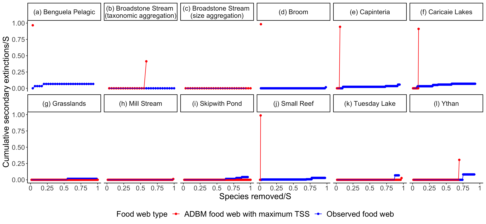

# Supplementary Information


```{r, echo=FALSE, fig.align='center', out.width="400px", fig.cap="\\label{fig:fig_r3} Cumulative secondary extinctions of species resulting from the primary removals of the \\textbf{least connected species} in the ADBM predicted food webs corresponding to the maximum TSS and observed food webs. S denotes the number of species in a food web. The cumulative secondary extinctions of species and the number of species removed have been normalised by the number of species."}

```


```{r, echo=FALSE, fig.align='center', fig.pos="H", out.width="450px", fig.cap="\\label{fig:fig_a1} The maximum trophic level of ADBM predicted food webs plotted against that of the observed food webs. Box represent the 25th and 75th percentile; bold midline represents the median; whisker represents outlier limits; the outlier coefficient used was 1.5. The dashed black lines are the 1:1 relationships for reference."}
knitr::include_graphics("../results/plot_max_tl_ADBM_vs_emp.png")
```


```{r, echo=FALSE, fig.align='center', fig.pos="H", out.width="450px", fig.cap="\\label{fig:fig_a2} Robustness comparison between the ADBM predicted food webs and the observed food webs for 12 food webs across different ecosystems for random and least connected extinction scenarios. Here, $R_{50}$ is the proportion of species that have to be removed to achieve a total loss of at least 50\\% of total species (primary removals and secondary extinctions). Box represent the 25th and 75th percentile; solid diamond represents the median; whisker represents outlier limits; the outlier coefficient used was 1.5. The dashed black lines are the 1:1 relationships for reference."}
knitr::include_graphics("../results/plot_R50_ADBM_vs_obs_ra_lc_facet.png")
```


