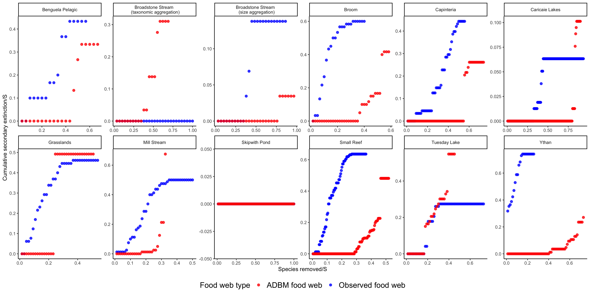

# Introduction

## Background on anthropogenic changes and its impact on food web

Anthropogenic changes such as climate change and habitat destruction is a threat to biodiversity and can lead to food web collapse. Climate change can lead to the collapse of a food web [@ullah2018]. Primary extinctions in a food web can give rise to further secondary extinctions in a food web resulting in collapse of the food web. The impact of this extinction is dependent on the complexity and structure of the food web (reference).

## Briefly explain work done by Jennifer Dunne on species extinctions

Simulation of primary species loss has been conducted in observed food webs and model food webs from terrestrial and aquatic ecosystems where robustness was measured in terms of secondary extinctions [@dunne2002network; @dunneCascadingExtinctionsCommunity2009]. These studies showed that the robustness of the food webs increases with food web connectance. When canonical experiments in natural ecosystems are not possible, this provides an alternate solution to investigate the impact of primary extinctions in a food web.

## ADBM predicted food webs

The allometric diet breadth model (ADBM) was the first model able to predict food web connectance (i.e. the number of realised links divided by total number of possible links) and structure (i.e. the arrangement of those links) [@beckerman2006; @petchey2008]. ADBM uses foraging theory specifically the contingency model [@macarthur1966] to predict the diet of each potential consumer and thereby the food web structure. 

## Robustness of ADBM predicted food webs

In Gupta et al. (2021), the ADBM parameterised with approximate Bayesian computation overestimated the food web connectance when compared with the observed connectance. It is crucial to investigate the implication of this overestimation in the robustness of predicted food webs. We suspect that the ADBM predicted food webs would be more robust as compared to the observed food webs.

## What we do in this study

In this study, we simulate primary species loss in 12 food webs predicted from the ADBM to quantify the secondary loss of extinctions. We use three different approaches of species removal: (i) most connected species, (ii) random species and (iii) least connected species to understand how the outcome varies among these approaches.

# Materials and methods

## Allometric Diet Breadth Model (ADBM)

The allometric diet breadth model (ADBM) is based on optimal foraging theory, specifically the contingency foraging model [@macarthur1966]. The ADBM predicts the set of prey species a consumer should feed upon to maximise its rate of energy intake [@petchey2008]. The foraging variables in the model: energy content of the resources, handling times of the prey, space clearance rate and prey densities are allometrically scaled to the body sizes of the species. 

## Food web data

The observed food webs that we fit the ADBM to belong to marine, freshwater and terrestrial ecosystems (Table \ref{fig:tab_1}). The observed connectance of these food webs is from 0.03 to 0.24 and there are 29 to 239 species. The food webs contain primary producers, herbivores, carnivores, parasites, and parasitoids. They also contain various types of feeding interactions, including predation, herbivory, bacterivory, parasitism, pathogenic, and parasitoid.

```{r echo=FALSE, warning=FALSE}
library(readxl)
library(knitr)
library(kableExtra)
fw_table <- read_excel("table/fw_table.xlsx")
kable(fw_table, format = "latex",
      caption = "\\label{fig:tab_1}Information about the food webs predicted using the ADBM.", escape = FALSE, align = "l") %>%
  kable_styling(font_size = 7, latex_options="scale_down", row_label_position = 1) %>%
  landscape(margin = "1cm") %>%
  column_spec(1, width = "3cm") %>%
  column_spec(2, width = "8em") %>%
  column_spec(7, width = "8em") %>%
  column_spec(8, width = "8em") %>%
  column_spec(9, width = "8em")
  
  
```

## Species removal

We implemented the primary species removal method from @dunneCascadingExtinctionsCommunity2009 by sequentially removing species using one of three criteria: removal of (i) the most-connected species, (ii) the least-connected species and (iii) randomly chosen species. The most-connected and least-connected criteria are based on the degree (i.e. total number of links to resource and links from consumer for each species) of species. Given a primary removal if any remaining species lost all of their resource species, or any cannibalistic species lost all of their resource species except the cannibalistic links, they are dropped from the web and were recorded as a secondary extinction. Then the next appropriate species are removed determining the most- and least-connected species based on the web remaining after all prior primary removals and secondary extinctions had occurred. This process was carried out until all species were extinct from the web.

Robustness (R) of food web was quantified as the proportion of species subjected to primary removals that resulted in a total loss (i.e. primary removals plus secondary extinctions) of some specified proportion of the species. In our study, we use $R_{50}$, primary extinctions that result in at least 50 per cent of total species loss [@dunne2002network; @dunne2004; @dunneCascadingExtinctionsCommunity2009]. Therefore, there is no secondary extinction in a maximally robust community ($R_{50} = 0.50$), whereas in a minimally robust community ($R_{50} = 1/S$) there is extensive secondary extinctions (i.e. at least $S/2 - 1$).

# Results

## Explain the secondary extinction curves

```{r, echo=FALSE, fig.align='center', out.width="500px", fig.cap="\\label{fig:fig_r1} Cumulative secondary extinctions for 12 food webs across different ecosystems."}

```

### Compare the results from the different methods

## Explain the outlier food webs: where the stability of ADBM predicted food webs is lower than empirical food webs

## Explain the robustness plots

### Compare the results from the different methods


# Discussion

## What does overestimation of connectance imply in terms of stability?

## Discuss how the robustness is dependent on the TSS of the predicted food web

* Would a higher TSS imply a higher difference in the robustness between predicted and observed food web?

## Compare the results from our study with results from other food web models (Jennifer A. Dunne and Williams (2009))

## Explain that the ADBM can only predicts contiguous diets

## Future prospect of using a dynamical model to model the temporal dynamics of the ADBM predicted food web


# References
