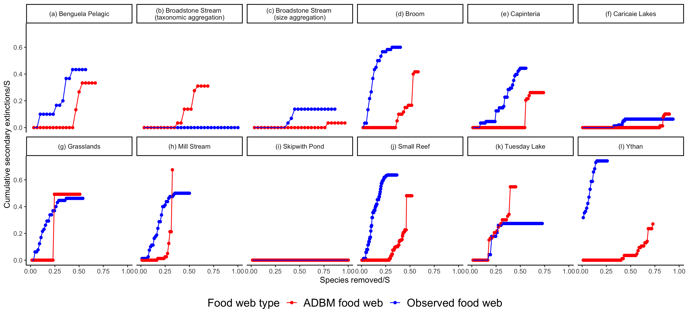
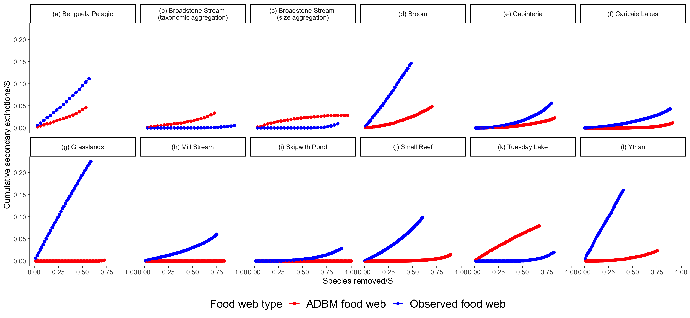
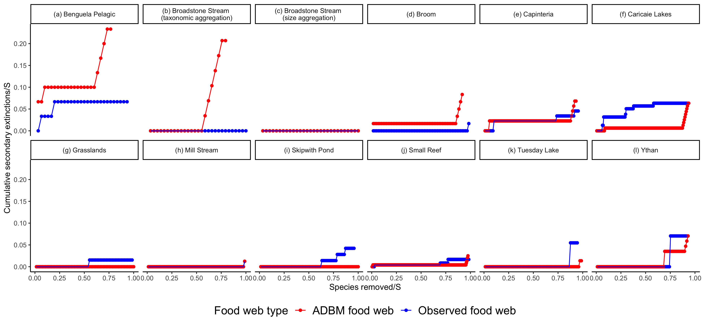
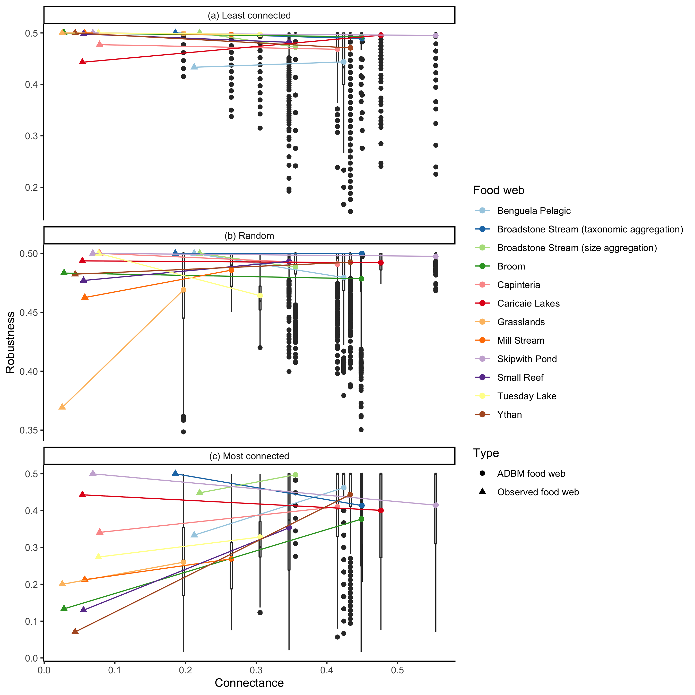

# Alternate titles

* Robustness of ADBM predicted food webs

# Introduction

## Background on anthropogenic changes and its impact on food web

Anthropogenic changes such as climate change and habitat destruction is a threat to biodiversity, and can lead to food web collapse [@ullah2018]. Primary extinctions in a food web can give rise to further secondary extinctions in a food web which can result in collapse of the food web (reference). The rate at which a primary extinctions can lead to secondary extinctions is dependent on the structure and complexity of that food web (reference). Understanding this can help to implement conservation efforts tailored to a given food web structure (reference).

## Briefly explain work done by Jennifer Dunne on food web [OP] robustness to primary extinctions, and also what has been done since, particularly concerning the importance of connectance

Simulation of primary species loss has been conducted in observed food webs and model food webs from terrestrial and aquatic ecosystems where robustness was measured in terms of secondary extinctions [@dunne2002network; @dunneCascadingExtinctionsCommunity2009]. These studies showed that the robustness of the food webs increases with food web connectance. Also, the removal of the most connected species cause considerably more secondary extinctions than random removals of species [@dunneNetworkStructureBiodiversity2002; @soleComplexityFragilityEcological2001]. These studies provide an alternate solution to investigate the impact of primary extinctions in a food web when canonical experiments in natural ecosystems are not possible.

Along with robustness based on topological structure of a food web, robustness based on the food web dynamics has been studied as well (reference). Topological approaches only require the food web structure whereas dynamical approaches also require the temporal dynamics of the food web along with the food web structure. For example: @williamsEffectsNetworkDynamical2008 combined models of network structure with models of bionergetic dynamics to study the role of food web topology and nonlinear dynamics on species coexistence in complex ecological networks.

[OP] Explain (either here or in the methods) difference between topological and abundance (given by dynamics) based criteria for a secondary extinction occurring. 

## [OP] State what is the problem...

A key assumption of this work is that food webs are very well sampled, so that all links that in reality can occur are represented. Yet it is known that not all food webs are very well sampled, and then do not represent all of the feeding links that occur (reference). One solution to this problem is to use a food web model to predict which are the missing links, and to then measure the robustness of the predicted food web. This solution is not fool proof, however, as it is likely that the food web model is not perfect, and so may still miss some links, and also may predict some links that could not, in fact occur.

## In previous work...

In Gupta et al. (2022) we made predictions of food web structure using the allometric diet breadth model (ADBM, [@beckerman2006; @petchey2008]) by fitting it to empirical data using approximate Bayesian computation, and the goodness of fit of the ADBM was measured using the true skill statistics which takes into account the presence of links as well as the absence of links. (ADBM uses foraging theory specifically the contingency model [@macarthur1966] to predict the diet of each potential consumer and thereby the food web structure.) A key finding of Gupta et al. (2022) was that the predicted food web connectance was consistently higher as compared to the observed connectance. This means that there were some trophic links (false positives) predicted by the ADBM which are not observed in the empirical food web data. Simultaneously there were some trophic links (false negatives) that were not predicted by the ADBM but were observed in the empirical food web. In that work there was no attempt to estimate the importance of these findings on computing the robustness of these food webs to species extinctions.

## What we do in this study

It is crucial to investigate the implication of this consistent overestimation of connectance in the robustness of predicted food webs. We expect that the ADBM predicted food webs would be more robust as compared to the observed food webs, and for the greater robustness to be related to the amount by which the ADBM overestimates connectance. In this study, we simulate primary species loss in 12 food webs predicted from the ADBM to quantify the secondary loss of extinctions. We use three different approaches of species removal: (i) most connected species, (ii) random species and (iii) least connected species to understand if the outcome varies among these approaches.

# Materials and methods

[OP] ## Provide overview of the methods

In the upcoming sections, we present a detailed account of the implementation of simulation of primary extinctions for three different scenarios on 12 food webs predicted by the ADBM from wide variety of ecosystems, and compute the resultant secondary extinctions. We then compute a robustness metric to quantify the robustness of those predicted food webs.

## Allometric Diet Breadth Model (ADBM)

The allometric diet breadth model (ADBM) is based on optimal foraging theory, specifically the contingency foraging model [@macarthur1966]. The ADBM predicts the set of prey species a consumer should feed upon to maximise its rate of energy intake [@petchey2008]. The foraging variables in the model: energy content of the resources, handling times of the prey, space clearance rate and prey densities are allometrically scaled to the body sizes of the species. 

## Food web data

The observed food webs that we fit the ADBM to belong to marine, freshwater and terrestrial ecosystems (Table \ref{fig:tab_1}). The observed connectance of these food webs is from 0.03 to 0.24 and there are 29 to 239 species. The food webs contain primary producers, herbivores, carnivores, parasites, and parasitoids. They also contain various types of feeding interactions, including predation, herbivory, bacterivory, parasitism, pathogenic, and parasitoid.

```{r echo=FALSE, warning=FALSE}
library(readxl)
library(knitr)
library(kableExtra)
fw_table <- read_excel("table/fw_table.xlsx")
kable(fw_table, format = "latex",
      caption = "\\label{fig:tab_1}Information about the food webs predicted using the ADBM.", escape = FALSE, align = "l") %>%
  kable_styling(font_size = 7, latex_options="scale_down", row_label_position = 1) %>%
  landscape(margin = "1cm") %>%
  column_spec(1, width = "3cm") %>%
  column_spec(2, width = "8em") %>%
  column_spec(7, width = "8em") %>%
  column_spec(8, width = "8em") %>%
  column_spec(9, width = "8em")
  
  
```

## Primary and secondary extinctions

We implemented the primary species removal method from @dunneCascadingExtinctionsCommunity2009 by sequentially removing species using one of three criteria: removal of (i) the most-connected species, (ii) the least-connected species and (iii) randomly chosen species. The most-connected and least-connected criteria are based on the degree (i.e. total number of links to resource and links from consumer for each species) of species. Given a primary removal if any remaining species lost all of their resource species, or any cannibalistic species lost all of their resource species except the cannibalistic links, they are dropped from the web and were recorded as a secondary extinction. Then the next appropriate species are removed determining the most- and least-connected species based on the web remaining after all prior primary removals and secondary extinctions had occurred. This process was carried out until all species were extinct from the web.

## Calculating robustness

Robustness (R) of food web was quantified as the proportion of species subjected to primary removals that resulted in a total loss (i.e. primary removals plus secondary extinctions) of some specified proportion of the species. In our study, we use $R_{50}$, the number of primary extinctions divided by the total number of species, that result in at least 50 per cent of total species loss [@dunne2002network; @dunne2004; @dunneCascadingExtinctionsCommunity2009]. Therefore, there is no secondary extinction in a maximally robust community ($R_{50} = 0.50$), whereas in a minimally robust community ($R_{50} = 1/S$) there is extensive secondary extinctions (i.e. at least $S/2 - 1$).

# Results

We first present the cumulative secondary extinctions in the food webs for three different extinction scenarios. We also computed the robustness metric for the food webs where the robustness metric quantifies the number of species extinctions required to have at least 50% of total number of species extinctions in a food web.

## Show and describe the secondary extinction curves

In Fig. \ref{fig:fig_r1}, \ref{fig:fig_r2} and \ref{fig:fig_r3}, we show the secondary extinction curves of ADBM predicted food webs and observed food webs for 12 different food webs under three different extinction scenarios. In general, irrespective of the extinction scenarios, we found that the cumulative secondary extinction was higher for the ADBM predicted food webs as compared to the observed food webs for most of the food webs.

In the most connected extinction scenario, the cumulative secondary extinction curve for the observed food webs rose quickly as compared to the ADBM predicted food webs, and then reach saturation after a certain number of primary removal of species. In some of the food webs (Fig. \ref{fig:fig_r1} (f, g, h, i, j, k)), there were intersection between the cumulative secondary extinction curves of ADBM predicted food webs and that of the observed food webs. In case of the Broadstone Stream (taxonomic aggregation) food web and the Tuesday Lake food web (Fig. \ref{fig:fig_r1} (b and k)), the secondary extinction curves for the ADBM food webs were higher than the observed food webs, whereas in case of the Skipwith Pond food web (Fig. \ref{fig:fig_r1} (i)), there were no secondary extinctions for any given number of primary removal of species.

```{r, echo=FALSE, fig.align='center', out.width="400px", fig.cap="\\label{fig:fig_r1} Cumulative secondary extinctions of species resulting from the primary removals of the most connected species for 12 food webs. S denotes the number of species in a food web. The cumulative secondary extinctions of species and the number of species removed have been normalised by the number of species."}

```

Except Broadstone Stream (taxonomic aggregation), Broadstone Stream (size aggregation) and Tuesday Lake food webs (Fig. \ref{fig:fig_r2} (b, c and k)), the mean cumulative secondary extinction curves for all the other food webs predicted by the ADBM were always lower than that of the observed food webs in the random extinction scenario. The shape of the cumulative secondary extinctions curves varied across the food webs.

```{r, echo=FALSE, fig.align='center', out.width="400px", fig.cap="\\label{fig:fig_r2} Mean cumulative secondary extinctions of species resulting from the primary removals of random species for 12 food webs. S denotes the number of species in a food web. The cumulative secondary extinctions of species and the number of species removed have been normalised by the number of species."}

```

Compared to the most connected and random extinction scenarios, the cumulative extinction curves in the least connected extinction scenario had very low values and were flat for most of the food webs (Fig. \ref{fig:fig_r3}) compared to the most connected extinction and random extinction scenarios. In most of the food webs, there was a lot of overlap between the extinction curves of the ADBM predicted foof webs and the observed food webs.

```{r, echo=FALSE, fig.align='center', out.width="400px", fig.cap="\\label{fig:fig_r3} Cumulative secondary extinctions of species resulting from the primary removals of the least connected species for 12 food webs. S denotes the number of species in a food web. The cumulative secondary extinctions of species and the number of species removed have been normalised by the number of species."}

```

## Show and describe the following:

I suggest to focus on the relationship between (difference in robustness between observed and predicted connectance) and (difference in robustness between the observed and predicted food web).

The ADBM predicted food webs were more robust than the observed food web with some exceptions (Fig. \ref{fig:fig_r4}). The food webs were more robust to least connected and random extinction scenarios than the primary deletion of the most connected species. The difference in the robustness values between the ADBM predicted food webs and observed food webs was higher in the most connected extinction scenario as compared to the least connected extinction and random extinction scenarios.

```{r, echo=FALSE, fig.align='center', out.width="400px", fig.cap="\\label{fig:fig_r4} Robustness plots for 12 food webs across different ecosystems. Here, $R_{50}$ is the proportion of species that have to be removed to achieve a total loss of at least 50\\% of total species (primary removals and secondary extinctions)."}

```

AG: I will also update the robustness plot for random extinction (Fig. 4 (b)) once the simulation is completed. The one shown here is only for few simulations and as a placeholder. It takes more time to compute.

# Discussion

The primary removal of species revealed that the ADBM predicted food webs are more robust than the observed food webs, and the shape of the robustness extinction curves varies between food webs. The food webs are least robust to primary extinction of the most connected species scenario compared to that of least connected and random extinction scenarios. A future development would be to understand the stability of the dynamics of the ADBM predicted food webs and compare it with our study.

...

## What does overestimation of connectance imply in terms of stability?

For most of the food webs, the primary removals of species resulted in a higher secondary extinction in the ADBM predicted food webs than that of the observed food webs (Fig. \ref{fig:fig_r1}, \ref{fig:fig_r2} and \ref{fig:fig_r3}). This can be attributed to the higher connectance of the ADBM predicted food webs as compared to that of the observed food webs because a species in a food web with a high connectance has on average more number of trophic links as compared to the food webs with low connectance. 

It would be intriguing to know if this difference in connectance has a similar influence in the dynamical stability of the food webs as well. Hence, a future prospect could be to use a dynamical model (for example: bionergetic food web model [@broseAllometricScalingEnhances2006]) to model the temporal dynamics of the ADBM predicted food webs. It would be interesting to know the temporal stability of these ADBM predicted food webs compared to the observed food webs because it has been known that food webs with increasing connectance stability diminishes [@mayWillLargeComplex1972].

...

Include here the possibility that the increased connectance would influence dynamical stability, and state if and why this may increase or decrease stability.


## Explain that the ADBM can only predicts contiguous diets [OP] and the implications of this

Using only body size as a trait, the ADBM can only predict diets that are contiguous with respect to the size of the prey. I.e. it cannot predict that a predator will consume prey of size 1 and 3, and not consume prey of size 2. Also, it is important to note that the observed diets were not contiguous when prey are ordered by their size, and this is due to some ecological differences in how predator group choose their prey [@caronAddressingEltonianShortfall]. So, the parameterisation process lead to a greater number of predicted links than observed. 

This higher connectance in the ADBM predicted food webs has lead to a higher robustness of the ADBM predicted food webs. An important question to ask here is how reliable are these results. We suspect that this is because the model and the observed data are wrong to some extent. We expect that some of the links that do in reality occur are not present in the observed datasets, which is quite possible because of low sampling effort or rare prey-predator interactions even when there is intensive sampling. This would mean that the false positives may actually be a correctly predicted link.

We suspect that the model is also predicting links which actually do not occur. This is because the current ADBM model only takes body size trait, and therefore only predicts contiguous diet. That would mean any interaction that is not possible because of some other traits not correlated with the body size would still be predicted by the model. For example, a species might have a defensive trait that could result in the predator species not predating on that species at all.

AG: (Caution) Some of the texts might be very similar to or same as in C1 MS. With multiple iterations of the current ms, the current text would be altered. Also, the current ms would be checked using a plagiarism software before submission.

...

<!-- ## Discuss how the robustness is dependent on the TSS of the predicted food web -->

<!-- * Would a higher TSS imply a higher difference in the robustness between predicted and observed food web? -->

<!-- OP: This (TSS and robustness relationship) would need to be presented in the Results, if this is to be included. -->

<!-- AG: I will present TSS and robustness relationship in the next version of the ms, and add relevant text here. -->

## Compare the results from our study with results from other food web models (Jennifer A. Dunne and Williams (2009))

The findings from our study is similar to what had been documented for other food web models [@dunneCascadingExtinctionsCommunity2009], in terms of increase in the robustness when the connectance of the food web is increased. A future study could be to understand the robustness of other food web models [@gravelInferringFoodWeb2013a] and compare it with our study. We expect similar results.

[OP] Including if and why we expect our findings to be replicated with those other models. Include some of Gravel and Poissot's models

...

<!-- Need to coordinate this content with what I proposed on line 141. -->

<!-- Line 141 is "Include here the possibility that the increased connectance would influence dynamical stability, and state if and why this may increase or decrease stability." -->

# References
