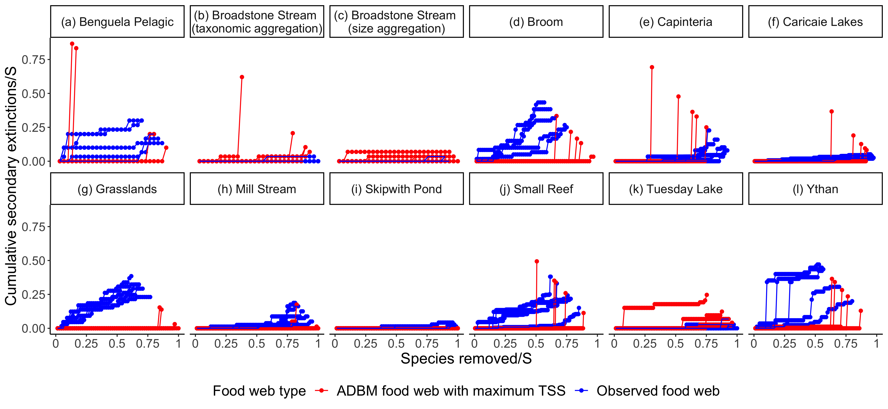

# Introduction

<!-- ## Background on anthropogenic changes and its impact on food web -->

Anthropogenic changes such as climate change and habitat destruction are a threat to biodiversity and can lead to food web collapse [@ullah2018]. This food web collapse is due to the cascades of secondary extinctions in a food web because of the primary loss of species due to environmental change [@pimmHumanImpactsRates2006; @thomasComparativeLossesBritish2004; @thomasExtinctionRiskClimate2004]. An example of a secondary extinction is when a consumer goes extinct because its sole resource species goes extinct. Therefore, research focused on cascading secondary extinctions, also known as 'community viability analysis', has been performed extensively in the past few decades to quantify how robust food webs are to species extinction [@dunne2002network; @dunneCascadingExtinctionsCommunity2009; @bergUsingSensitivityAnalysis2011; @ebenmanCOMMUNITYVIABILITYANALYSIS2004; @ebenmanUsingCommunityViability2005]. This research revealed that the rate of collapse of a food web depends on its structure and complexity [@dunne2002network; @dunneCascadingExtinctionsCommunity2009].

Simulation of primary species loss has been conducted in observed food webs and model food webs from terrestrial and aquatic ecosystems, where robustness was measured in terms of secondary extinctions [@dunne2002network; @dunneCascadingExtinctionsCommunity2009]. Primary species loss is considered to be extinction of a species due to causes external to the food web, e.g. overharvesting [@koningGrassrootsReservesRescue2021], introduction of invasive species [@davidImpactsInvasiveSpecies2017]. A secondary extinction is an extinction caused by a previous extinction (either primary or secondary). Numerous studies have used topological criterion for assigning a secondary extinction to a species, i.e., if extinction is of the last resource species of a consumer species, then the consumer species suffers secondary extinction [@dunne2002network; @dunneCascadingExtinctionsCommunity2009; @soleComplexityFragilityEcological2001].  

When there are few primary extinctions, and these cause many secondary extinctions, a food web is said to be fragile or not robust. In contrast, a food web is said to be robust when there are only a few secondary extinctions. Several studies have shown that the robustness of the food webs increases with food web connectance [@dunneNetworkStructureBiodiversity2002; @dunneCascadingExtinctionsCommunity2009]. Additionally, these studies have demonstrated that the removal (primary extinction) of the most connected species causes considerably more secondary extinctions than the random removals of species [@dunneNetworkStructureBiodiversity2002; @soleComplexityFragilityEcological2001]. Simulation studies like these, which investigate the impact of primary extinctions in a food web to quantify robustness based on its topological structure, provide an alternate solution to canonical experiments in natural ecosystems, which are not possible or very difficult to conduct [@dunneCascadingExtinctionsCommunity2009].

Along with quantifying food web robustness based on its topological structure, studies such as @williamsEffectsNetworkDynamical2008, @broseAllometricScalingEnhances2006, and @martinezDiversityComplexityPersistence have quantified robustness based on the abundance dynamics of a food web. However, the topological approach of quantifying a food web's robustness only requires the food web structure, whereas the dynamical approach requires the food web structure and the temporal dynamics of the abundance of species in that food web. For example, @williamsEffectsNetworkDynamical2008 combined network structure models with bioenergetic dynamics models to study the role of food web topology and nonlinear dynamics on species coexistence in complex ecological networks.

<!-- ## [OP] State what is the problem... -->

A key assumption of the observed food webs is that they are very well sampled, i.e. all the links that in reality can occur are represented. However, it is known that not all food webs are very well sampled and do not represent all of the feeding links that can occur [@caronAddressingEltonianShortfall; @patonaiAggregationIncompleteFood2017; @jordanoSamplingNetworksEcological2016]. Some rare trophic links require more sampling effort than others, whereas some trophic links remain unobserved because of biological constraints such as spatio-temporal uncoupling, size or reward mismatching, foraging constraints and physiological-biochemical constraints, which are irrespective of sufficient sampling effort [@jordanoSamplingNetworksEcological2016]. Previous studies such as @caronAddressingEltonianShortfall and @guptaSimultaneouslyEstimatingFood2022 have shown that the predicted food webs from these models usually have greater connectance than the observed ones. One solution to compensate for undersampling is using a food web model such as the Allometric Diet Breadth Model (ADBM) [@petchey2008] to predict the missing links and then measure the robustness of the predicted food web. The ADBM is a mechanistic model constructed using foraging rules based on the body sizes of prey and predator, where trophic interactions satisfying those rules would be predicted by the model, which are perhaps not observed because those interactions are rare. However, this solution is not infallible, as it is likely that the food web model might still miss some links and also may predict some links that could not, in fact occur.

<!-- ## What we do in this study -->

In our study, we investigate the topological robustness of the ADBM predicted food webs and compare it to that of the observed food webs. We expect the ADBM predicted food webs to be more robust than the observed food webs, and for the greater robustness to be related to the amount by which the ADBM predicts greater connectance compared to that of the observed food webs. We do this by simulating primary species loss in 12 food webs predicted by the ADBM to quantify the secondary loss of extinctions and compare the robustness of food webs predicted by the ADBM to the robustness of the observed food webs. We use three different approaches of primary species removal: (i) most connected species, (ii) random species and (iii) least connected species to understand if the outcome varies among these approaches. 

# Materials and methods

In the upcoming sections, we present a detailed account of the implementation of the simulation of primary extinctions for three different extinction scenarios on 12 food webs predicted by the ADBM from a wide variety of ecosystems and compute the resultant secondary extinctions. We then describe a robustness metric of those predicted food webs and how we compare them to the properties of the food webs.

## Allometric Diet Breadth Model (ADBM)

The allometric diet breadth model (ADBM) is based on optimal foraging theory, specifically the contingency model [@macarthur1966]. We chose this model because it is known to predict greater connectance in the predicted food webs compared to the observed food webs [@guptaSimultaneouslyEstimatingFood2022]. The ADBM predicts the set of prey species a consumer should feed upon to maximise its rate of energy intake [@petchey2008]. The foraging variables used in the model are the energy content of prey, handling times of the predator on prey, space clearance rate, i.e. how fast a predator searches space, and prey densities. Each of these variables is derived from the allometric scaling relationship using the body sizes of species. More details on the foraging rules defined in the ADBM and ADBM's predictive power across different food webs can be found in open access @petchey2008.

## Food web data

The observed food webs that we fit the ADBM to belong to marine, freshwater and terrestrial ecosystems (Table \ref{fig:tab_1}). We considered these food webs because they belong to diverse ecosystems and follow FAIR (Findable Accessible Interoperable Reusable) principles [@wilkinsonFAIRGuidingPrinciples2016]. These food webs contain primary producers, herbivores, carnivores, parasites, and parasitoids and various feeding interactions, including predation, herbivory, bacterivory, parasitism and pathogenic. The observed connectance of these food webs varies from 0.03 to 0.24 (Links/Species$^2$), and the number of species varies from 29 to 239. The goodness of fit of the ADBM's predictions depends on the interaction types in the food webs. For example, those with size-structured interactions, such as herbivory in aquatic ecosystems, are better predicted compared to less size-structured ones, such as parasitoids and terrestrial herbivory ones [@petchey2008].

```{r echo=FALSE, warning=FALSE}
library(readxl)
library(knitr)
library(kableExtra)
fw_table <- read_excel("table/fw_table.xlsx")
kable(fw_table, format = "latex",
      caption = "\\label{fig:tab_1}Information about the food webs predicted using the ADBM.", escape = FALSE, align = "l") %>%
  kable_styling(font_size = 7, latex_options="scale_down", row_label_position = 1) %>%
  landscape(margin = "1cm") %>%
  column_spec(1, width = "4cm") %>%
  column_spec(2, width = "3cm") %>%
  column_spec(4, width = "2cm") %>%
  column_spec(5, width = "2cm") %>%
  column_spec(6, width = "3cm")
  
  
```

<!-- ## \*\*OP: need a section on how the food web model was fit to the data. Also should state how we deal with / use the uncertainty contained in the posterior joint distribution. -->

## Model parameterisation using approximate Bayesian computation

The ADBM was parameterised using approximate Bayesian computation (ABC), where a set of parameter values were sampled from a prior distribution. Then, that set of parameter values was either accepted or rejected based on how close the predicted food web was to the observed food web using an accuracy metric -- true skill statistic (TSS). The accepted parameter values formed a posterior distribution (Fig. 4 and S14-S25 in @guptaSimultaneouslyEstimatingFood2022). Further, prediction intervals of the true skill statistic and connectance of the predicted food webs were computed (Fig. 5 (a, b) in @guptaSimultaneouslyEstimatingFood2022). In our study, we considered model predicted food webs where the predicted connectance lay within the 95% prediction interval of all model predicted food webs. A detailed explanation of the parameterisation method can be found in @guptaSimultaneouslyEstimatingFood2022.

## Extinction scenarios and robustness

We implemented the primary species removal method from @dunneCascadingExtinctionsCommunity2009 by sequentially removing species using one of the three criteria: removal of (i) the most connected species, (ii) the least connected species and (iii) randomly chosen species. The most connected and least connected criteria are based on species' degree (i.e. the total number of links to resources and from consumers). We considered these three criteria because the random extinction scenario takes into account all the theoretically possible extinction sequences of species that can occur in a food web, while the extinction of the most connected species and least connected species takes into account the two opposite extreme scenarios. These extinction scenarios have been widely used in studying species extinctions and the collapse of food webs and other networks [@dunne2002network; @soleComplexityFragilityEcological2001; @dunne2004; @dunneCascadingExtinctionsCommunity2009; @albertStatisticalMechanicsComplex2002].

Given a primary removal of species in a food web, if any remaining species lost all of their resource species, or any cannibalistic species lost all of their resource species except the cannibalistic links, they are removed from the web, and a secondary extinction was recorded. Secondary extinctions may cause further secondary extinctions, which were also checked for and recorded. Once no more secondary extinctions occurred, then another primary extinction was made of the next appropriate species depending on the extinction scenario. This process was carried out until all the species were extinct from the food web.

The robustness (R) of a food web was defined as the proportion of species subjected to primary removals resulting in extinction (primary and secondary extinctions) of some specified proportion of the species. In our study, we use $R_{50}$, the number of primary extinctions divided by the total number of species, which results in at least 50% of total species loss [@dunne2002network; @dunne2004; @jonssonReliabilityR50Measure2015; @dunneCascadingExtinctionsCommunity2009]. Therefore, if primary extinctions never cause any secondary extinctions, the food web is maximally robust and ($R_{50} = 0.50$). Whereas in a minimally robust community ($R_{50} = 1/S$, where $S$ is the number of species), the first primary extinction causes a cascade of secondary extinctions of at least nearly half of the species in the food web (i.e. at least $S/2 - 1$).


## Simulating species extinctions

First, we simulated primary species loss in food webs predicted by the ADBM which had the maximum true skill statistics and compared it to primary species loss in observed food webs. Second, to take into account the uncertainty in robustness in the ADBM predicted food webs, we simulated primary species loss and thereby computed robustness for all the ADBM predicted food webs corresponding to the 95% prediction interval of the predicted connectance. Furthermore, in the case of the random extinction scenario, we simulated 1000 random extinction sequences in a single ADBM predicted food web.

## Analysis

In the random extinction scenario, we computed robustness $R_{50}$ for all 1000 independent random extinction sequences and calculated the median as a summary statistics to quantify the average robustness of a single food web to random extinction. To quantify the effect of undersampling, i.e. greater connectance of connectance, we compute the ratio of the difference in normalised robustness between the ADBM predicted food webs and observed food webs to the difference in their normalised connectance, where normalisation was performed by dividing the variables by their maximum possible values (i.e. 0.5 for $R_{50}$ and 1 for connectance). However, we did not perform any statistical significance test because we work with simulated food webs and therefore, the p-values of these tests are influenced by the number of model simulations [@whiteEcologistsShouldNot2014].

# Results

We first present the secondary extinction curves of the ADBM predicted food webs which had the maximum true skill statistics and of the observed food webs for 12 food webs under three different extinction scenarios. We then compare the robustness of all the ADBM predicted food webs within the 95% prediction interval against that of the observed food webs to take into account uncertainty in the robustness across food webs predictions. Finally, we quantify the effect of the difference in their connectance on the difference in their robustness estimates.

## Secondary extinctions

In the most connected extinction scenario, the cumulative secondary extinction curves started to rise steeply in the observed food webs at a lower number of primary species removal as compared to the ADBM predicted food webs for nine food webs (Fig. \ref{fig:fig_r1} (a, c, d, e, f, g, h, j, l)). However, there was a higher number of cumulative secondary extinctions occurring in the ADBM predicted food webs when compared to that of the observed food webs at a high number of primary species removal in five food webs (Fig. \ref{fig:fig_r1} (a, f, g, h, k)). In the Skipwith Pond food web, there were no secondary extinctions for any number of primary removal of species (Fig. \ref{fig:fig_r1} (i)), whereas in the Broadstone Stream (taxonomic aggregation) food web the same was true only for the observed food web but in the ADBM predicted food web there was a steep rise in the cumulative secondary extinctions (Fig. \ref{fig:fig_r1} (b)).

```{r, echo=FALSE, fig.align='center', out.width="400px", fig.cap="\\label{fig:fig_r1} Cumulative secondary extinctions of species resulting from the primary removals of the \\textbf{most connected species} in the ADBM predicted food webs corresponding to the maximum TSS and observed food webs. S denotes the number of species in a food web. The cumulative secondary extinctions of species and the number of species removed have been normalised by the number of species."}
knitr::include_graphics("../results/plot_mostconnected_maxTSS.png")
```

In Fig. \ref{fig:fig_r2}, we present the cumulative secondary extinctions in the ADBM predicted and the observed food webs for five (out of 1000) independent random extinction sequences to show example variation caused by different random primary extinction orders. The secondary extinction curves of the ADBM predicted food webs were steeper than that of the observed food webs, i.e. primary removal of some species in an extinction sequence can lead to the complete collapse of the remaining food web in the ADBM predicted food webs.

```{r, echo=FALSE, fig.align='center', out.width="400px", fig.cap="\\label{fig:fig_r2} Cumulative secondary extinctions of species resulting from the primary removals of \\textbf{random species} in the ADBM predicted food webs corresponding to the maximum TSS and observed food webs for five (out ot 1000) independent random extinction sequences. S denotes the number of species in a food web. The cumulative secondary extinctions of species and the number of species removed have been normalised by the number of species."}

```

Compared to the most connected and random extinction scenarios, there were fewer secondary extinctions in the least connected extinction scenario, and therefore the secondary extinction curves were flat for many of the food webs (Fig. \ref{fig:fig_r3}). In some of the food webs, the extinction curves of the ADBM predicted food webs overlapped with the observed food webs (Fig. \ref{fig:fig_r3} (b, c, g, h, i, k, l)}). In five of the food webs, a very high number of secondary extinctions occurred at a very low number of primary species removal (Fig. \ref{fig:fig_r3} (a, d, e, f, j)).

```{r, echo=FALSE, fig.align='center', out.width="400px", fig.cap="\\label{fig:fig_r3} Cumulative secondary extinctions of species resulting from the primary removals of the \\textbf{least connected species} in the ADBM predicted food webs corresponding to the maximum TSS and observed food webs. S denotes the number of species in a food web. The cumulative secondary extinctions of species and the number of species removed have been normalised by the number of species."}
knitr::include_graphics("../results/plot_leastconnected_maxTSS.png")
```

## Robustness 

The ADBM predicted food webs were more robust than the observed food webs on average in the most connected and random extinction scenarios (Fig. \ref{fig:fig_r4} (a, b)). However, there were large variations in the robustness within the ADBM predicted food webs in the most connected extinction scenario (Fig. \ref{fig:fig_r4} (a)). For example, the ADBM predicted Caricaie Lakes food web was more robust than the observed food web on average but had a larger variation in the robustness within the ADBM predicted food webs compared to other food webs. 

The food webs were more robust to the random extinction scenario than the most connected scenario (Fig. \ref{fig:fig_r4} (a, b)). Small Reef and Benguela Pelagic food webs had more variations in robustness within the ADBM predicted food webs as compared to the other food webs (Fig. \ref{fig:fig_r4} (b)). Skipwith Pond, Broadstone Stream (taxonomic aggregation) and Broadstone Stream (size aggregation) food webs were the most robust (Median $R_{50} = 0.5$) for both ADBM predicted and observed food webs. Although there were few less robust ADBM predicted food webs in the Broadstone Stream (size aggregation) as shown by the outliers. The food webs were more robust to the random extinction scenario than the most connected scenario (Fig. \ref{fig:fig_r4} (a, b)). Small Reef and Benguela Pelagic food webs had more variations in robustness within the ADBM predicted food webs as compared to the other food webs (Fig. \ref{fig:fig_r4} (b)). Skipwith Pond, Broadstone Stream (taxonomic aggregation) and Broadstone Stream (size aggregation) food webs were the most robust (Median $R_{50} = 0.5$) for both ADBM predicted and observed food webs. Although there were few less robust ADBM predicted food webs in the Broadstone Stream (size aggregation) as shown by the outliers.

In the least connected extinction scenario, the food webs had a very high robustness (Median $R_{50} = 0.5$) for most of the food webs (Fig. \ref{fig:fig_r4} (c)), however there were some exceptions. The ADBM predicted food webs for Small Reef and Benguela Pelagic had very low median robustness. Benguela Pelagic, Broom and Capinteria food webs from the ADBM had larger variations in robustness when compared to that of the others.

```{r, echo=FALSE, fig.align='center', out.width="450px", fig.cap="\\label{fig:fig_r4} Robustness comparison between the ADBM predicted food webs and the observed food webs for 12 food webs across different ecosystems. Here, $R_{50}$ is the proportion of species that have to be removed to achieve a total loss of at least 50\\% of total species (primary removals and secondary extinctions). Box represent the 25th and 75th percentile; solid diamond represents the median; whisker represents outlier limits; the outlier coefficient used was 1.5. Some points are not visible due to perfect overlap in b and c. Refer to Fig. 7 in the Supplementary Information for a faceted visualisation. The dashed black lines are the 1:1 relationships for reference."}
knitr::include_graphics("../results/plot_R50_ADBM_vs_obs.png")
```


In all of the food webs except Small Reef and Broadstone Stream (taxonomic aggregation), the effect size of connectance on robustness was positive on average in the most connected extinction scenario (Fig. \ref{fig:fig_r5} (a)), i.e. greater connectance had a positive effect on the robustness. In the random extinction scenario, there was a positive effect of greater connectance on the robustness for Ythan, Small Reef, Mill Stream, Grasslands, Caricaie Lakes, Capinteria, Broom and Benguela Pelagic (Fig. \ref{fig:fig_r5} (b)). However, the effect size varied across the food webs. In the least connected extinction scenario, the median effect sizes were zero or very close to zero for all the food webs except Benguela Pelagic and Small Reef food webs where the median effect sizes were negative (Fig. \ref{fig:fig_r5} (c)). However, there were lots of outlier effect sizes less than zero.

```{r, echo=FALSE, fig.align='center', out.width="450px", fig.cap="\\label{fig:fig_r5} Effect size (i.e. ratio of the difference in normalised robustness between ADBM predicted food webs and observed food webs to the difference in their normalised connectance) shown for the 12 food webs. Box represent the 25th and 75th percentile; bold black midline represents the median; whisker represents outlier limits; the outlier coefficient used was 1.5."}
knitr::include_graphics("../results/plot_R50_slope.png")
```

# Discussion

As expected, the ADBM predicted food webs were more robust than the observed food webs on average. The considerable variation of the robustness of the ADBM predicted food webs suggests, however, that undersampling in food webs can lead to considerable uncertainty in the estimates of food web robustness, even when a model is used to compensate for undersampling. Furthermore, as was previously found, the food webs are least robust to primary extinction of the most connected species compared to that of least connected and random extinction scenarios on average. Future development would be to understand how undersampling, i.e. predicted greater connectance, influences the stability of the dynamics of the ADBM predicted food webs against that of the observed food webs and compare it with the patterns in our study in which extinction occur only by topological criteria. However, one would expect a decrease in food web stability with greater connectance [@martinezDiversityComplexityPersistence; @mayWillLargeComplex1972].

As mentioned, the robustness of the ADBM predicted food webs was higher than that of the observed food webs on average (Fig. \ref{fig:fig_r4}) for all of the 12 food web ecosystems (with some exceptions). This is likely due to the greater connectance of the ADBM predicted food webs as compared to that of the observed food webs because a species in a food web with a higher connectance has, on average, more trophic links as compared to a food web with a lower connectance (Fig. \ref{fig:fig_r5}). Our study suggests that it is important to consider undersampling in observed food webs when computing their robustness.

## A paragraph on the implication of our study

* On the uncertainty in the ADBM estimates 
* On the limitation of a food web model 
* On undersampling 

Contrary to general expectations [@dunneNetworkStructureBiodiversity2002], food web robustness did not always increase with the connectance (Fig. \ref{fig:fig_r5}). For example, the Benguela Pelagic and Small Reef ADBM predicted food webs were surprisingly less robust to primary extinctions on average in the least connected extinction scenario compared to the observed food webs (Fig. \ref{fig:fig_r4} (c) and \ref{fig:fig_r5} (c)). In these two food webs, the extinction of the least connected species could cause an almost complete, or complete collapse of the food web. We suspect this is because the ADBM predicted food webs have a lower proportion of basal species when compared to that of the observed food webs (Fig: 6 (a) in @guptaSimultaneouslyEstimatingFood2022). As a result, these low-degree basal species are the ones to be removed at an early stage in the deletion sequence, thereby resulting in an earlier food web collapse in the ADBM predicted food web as compared to that of the observed food web (Fig: \ref{fig:fig_r3} (a) and (j)). This suggests that the greater connectance predicted by the ADBM resulted in a more robust food web on average. However, differences in the predicted food web properties, such as a lower proportion of basal species and higher maximum trophic level (Fig: \ref{fig:fig_a1}) when compared to that of the predicted food webs counteracted that effect and led to reduced robustness. On average, a consumer in a food web with a higher maximum trophic level would have fewer resources and be more susceptible to extinction than a consumer in a food web with a lower maximum trophic level [@binzerSusceptibilitySpeciesExtinctions2011]. This suggests that food web properties other than connectance play an important role in determining a food web's robustness and, therefore, should also be taken into account [@binzerSusceptibilitySpeciesExtinctions2011; @mendoncaRobustnessTemperateTropical2022; @riedeSizebasedFoodWeb2011].

As with any food web model, we expect that there are real false positives in the food webs predicted by the ADBM. Real false positive means that the food web model predicts a link between two species that can never interact. (The other type of false positive is when the model predicts a link that was not observed but could have been observed if the food web was sampled enough. In this case, further sampling should result in the link being observed and a change from false positive to true positive.) Firstly, this may be because the ADBM uses only body size as a trait. A trait uncorrelated with the body size may be influential in determining the interaction between two species [@guptaSimultaneouslyEstimatingFood2022]. Secondly, the ADBM can only predict diets that are contiguous with respect to the size of the prey. I.e. it cannot predict that the consumer will consume prey of size 1 and 3, and not consume prey of size 2. However, it is important to note that observed diets are not always contiguous when prey are ordered by their size due to some ecological differences in how predator species choose their prey [@caronAddressingEltonianShortfall]. Hence, it would be intriguing to extend our study to use other food web models based on size-based rules, such as @gravelInferringFoodWeb2013a and @vagnonAllometricNicheModel2021, to understand if the results are dependent on the decision of model selection. We expect to get a similar result in a size-based deterministic model but a different result, i.e. lower robustness in a size-based stochastic model as compared to the ADBM because the latter can take into account non-contiguity in predator diets [@williamsProbabilisticNicheModel2010]. It would also be interesting to use food web models not based on body size, such as @cattinPhylogeneticConstraintsAdaptation2004 and @allesinaGeneralModelFood2008. We expect to have a difference in results based on whether the trophic interactions in the food webs are governed by size-structured rules or not.

It would be intriguing to know if this difference in connectance has a similar influence on the dynamical stability of the food webs as well. Hence, a prospect could be to use a dynamical model (for example, the bioenergetic food web model by @broseAllometricScalingEnhances2006) to model the temporal dynamics of the ADBM predicted food webs. We expect that the greater connectance will lead to reduced dynamical stability in the ADBM predicted food web compared to that of the predicted food web. The difference in stability will be linearly related to the difference in connectance because @martinezDiversityComplexityPersistence has shown that food web stability linearly decreases with connectance.

<!-- ## Use food web properties to parameterise the ADBM via ABC -->

Since the ADBM predicted food webs have a lower proportion of basal species and a higher maximum trophic level as compared to that of the observed food webs (Fig: 6 (a) in @guptaSimultaneouslyEstimatingFood2022 and Fig. \ref{fig:fig_a1} in Supplementary Information), it would be interesting to use these properties as summary statistics to parameterise the ADBM and investigate how that influences the difference in the robustness between the ADBM predicted and the observed food webs. We would expect a more highly constrained predicted food web structure, lower variation in robustness, and a greater apparent influence of connectance on robustness.

<!-- ## Conclusion -->

We have used a food web model to compensate for undersampling in recorded food webs and thereby quantified the influence of missing links, i.e. greater connectance on the topological robustness of 12 food webs from various ecosystems. We found that the greater connectance can have a large impact on the robustness of the food webs while at the same time producing large variations in robustness among the predicted food webs. Furthermore, differences in other structural food web properties between the ADBM predicted food webs and the observed food webs are also responsible.

# Acknowledgements

This work was supported by the University Research Priority Program Global Change and Biodiversity (Grant number: U-704-04-11) of the University of Zurich. We thank the Petchey group members for their valuable suggestions in the manuscript.

# Conflict of interest

None declared

# Author contributions

**Anubhav Gupta:** Conceptualisation; Data curation; Formal analysis; Investigation; Methodology; Project administration; Software; Validation; Writing -- original draft; Writing -- review and editing. **Owen L. Petchey:** Conceptualization; Funding acquisition; Resources; Supervision; Writing -- review & editing.

# Data Accessibility Statement

All the data used in this study was collected in other studies and is openly available. We list those studies and the open access source in Table \ref{fig:tab_1}. The complete code used in the analysis is available in the repository <https://doi.org/10.5281/zenodo.7180835>.

# Supplementary Information

```{r, echo=FALSE, fig.align='center', fig.pos="H", out.width="450px", fig.cap="\\label{fig:fig_a1} The maximum trophic level of ADBM predicted food webs plotted against that of the observed food webs. Box represent the 25th and 75th percentile; bold midline represents the median; whisker represents outlier limits; the outlier coefficient used was 1.5. The dashed black lines are the 1:1 relationships for reference."}
knitr::include_graphics("../results/plot_max_tl_ADBM_vs_emp.png")
```


```{r, echo=FALSE, fig.align='center', fig.pos="H", out.width="450px", fig.cap="\\label{fig:fig_a2} Robustness comparison between the ADBM predicted food webs and the observed food webs for 12 food webs across different ecosystems for random and least connected extinction scenarios. Here, $R_{50}$ is the proportion of species that have to be removed to achieve a total loss of at least 50\\% of total species (primary removals and secondary extinctions). Box represent the 25th and 75th percentile; solid diamond represents the median; whisker represents outlier limits; the outlier coefficient used was 1.5. The dashed black lines are the 1:1 relationships for reference."}

```

# References
